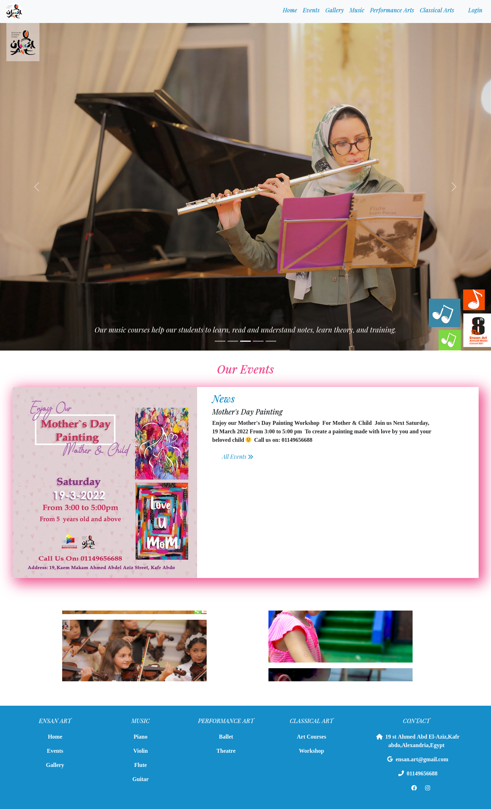
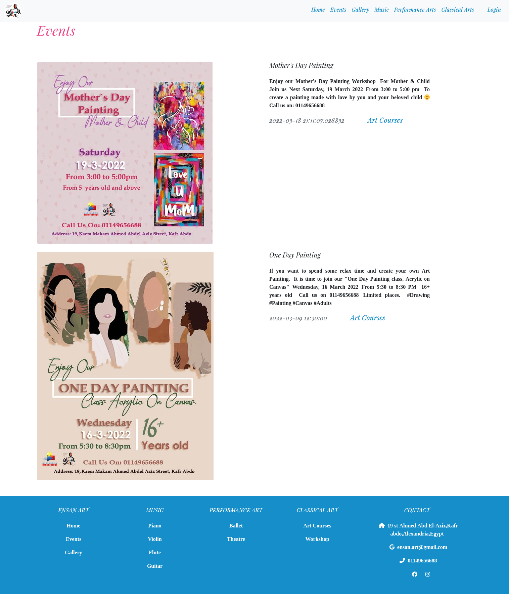
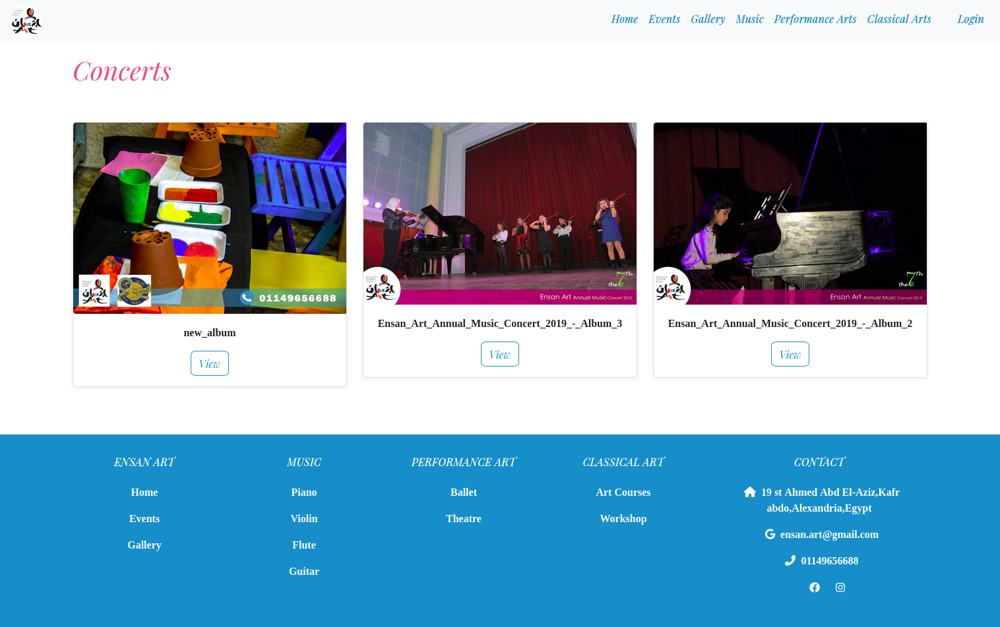
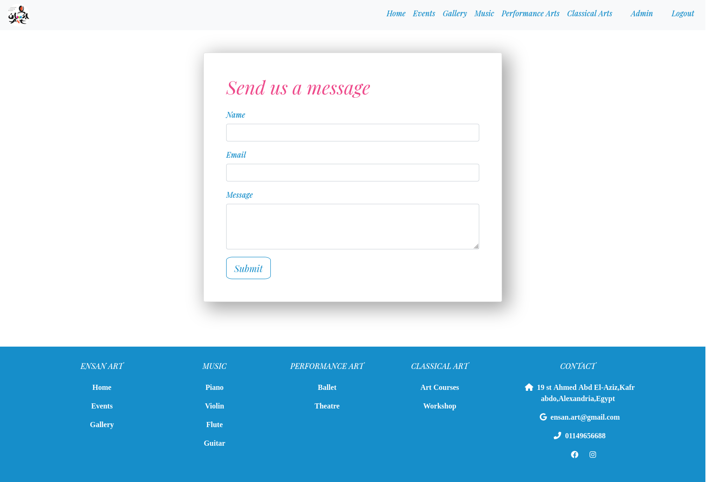
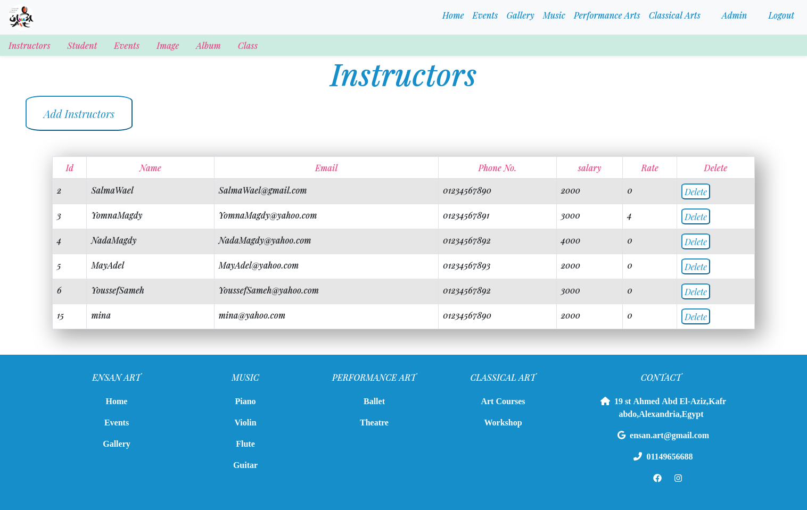
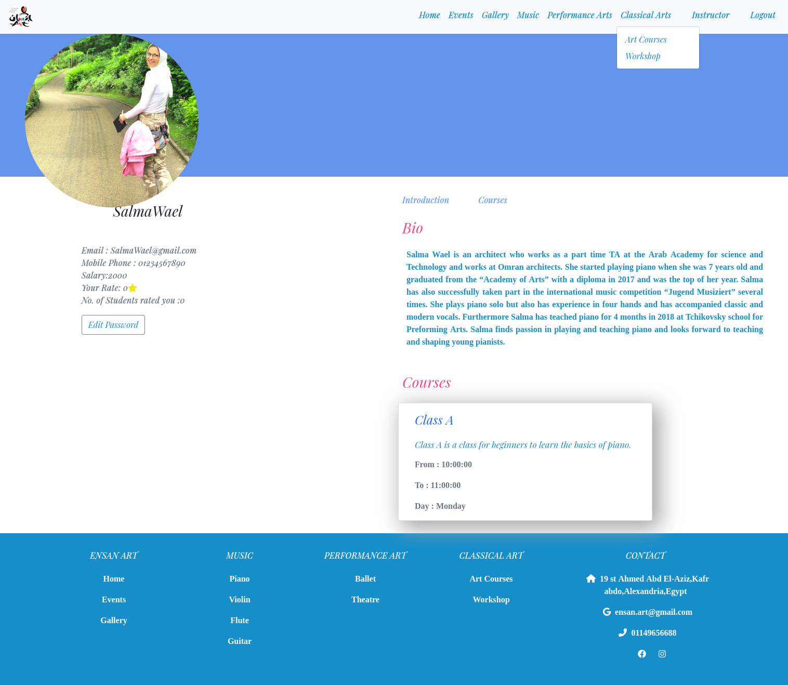
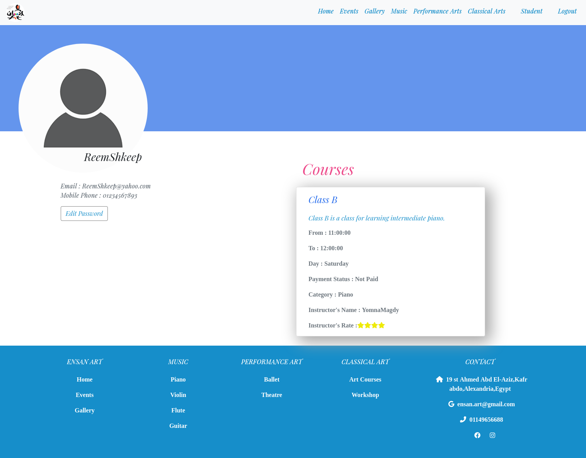

# 
Website for art center

## [Demo](Demo.mp4)

<b>A website typically consists of many web pages linked together in a coherent fashion.</b>

- <b>you can see the details for each item in the navbar in a separite page</b>
    - Navbar consists of Home, Events, Gallery, Music, Performance Art,Login 
    - slider that shows real photos of the center 
    - Events with the latest news of the center  
    - Latest events are displayed in home page    
    - Photo Albums including 4 categories ( Concerts ,Workshops ,
        Exhibitions ,Classes )
    - A marquee that displays the rest of the photos 
    - the footer that contain the same Navbar pages.

<b>The project contain landing page that display all posts and categories</b>

- <b>here you can see the events of the art center</b>
    - the events are arranged from the latest to the oldest
    - each event has a title, content , date , picture and category
    

- <b>Gallery has 4 categories : Concerts,Classes,Exhibitions and Workshop</b>
- <b>here you can see the albums of one of the categorys of the gallery</b>
    - each album has a name and a view button
    - each album has a number of photos that the admin has added

- <b>Music has 4 categories : guitar,violin,flute,piano</b>
- <b>the first category is piano</b>

    - piano page has 3 sections
    - first section is a slider with photos 
    - second section is a about our classes
    - third section is a about our instructors 
    - at the end of the page, a join us button which leads to a form that user can send to the admin an email

<b> Multiple user types : Admin – Instructor – Student </b>

    - you can log in as  Admin – Instructor – Student  
        Admin:
         -Has the ability to control administration dashboard with crud operations.
         -who can add both of student and instructor (controls the members )
        
        Instructor:
         - has his own profile that contains class details and his data including his average rate and no. of 
            students rated him .

        Student:
         - can rate his instructor (only his instructor) 
         - has his own profile that contains class details and students data.

- <b>finally you are welcome to be one of our users</b>
    

### Contact Us

### Samah Gaber
[Github](https://github.com/samahgabermohamed)

[Linked in](https://www.linkedin.com/in/samah-gaber-62099b166)

### Sandra Girgis
[Github](https://github.com/sandra-girgis)

[Linked in](https://www.linkedin.com/in/sandra-girgis)

### Omar Akl
[Github](https://github.com/omartarekakl)

[Linked in](https://www.linkedin.com/in/omar-akl-a2185b203)

### Reem Shkeep
[Github](https://github.com/ReemShkeep)

[Linked in](https://www.linkedin.com/in/reem-shkeep/)

### Rehab Mohamed
[Github](https://github.com/Rehabmohamed19)

[Linked in](https://www.linkedin.com/in/rehab-mohamed-09a2ba219/)
